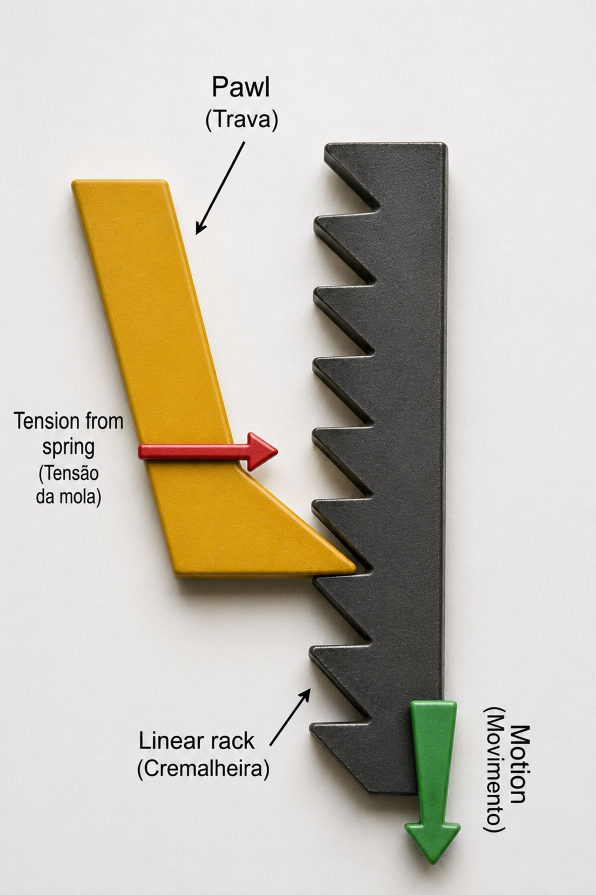
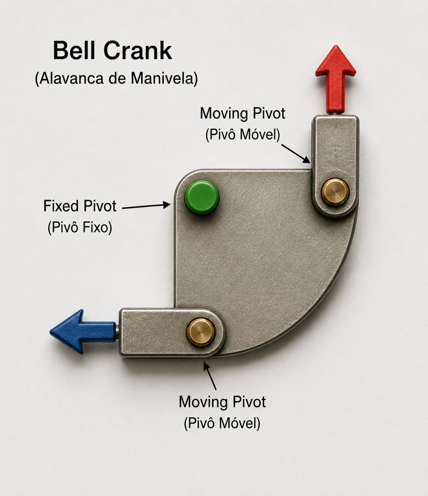
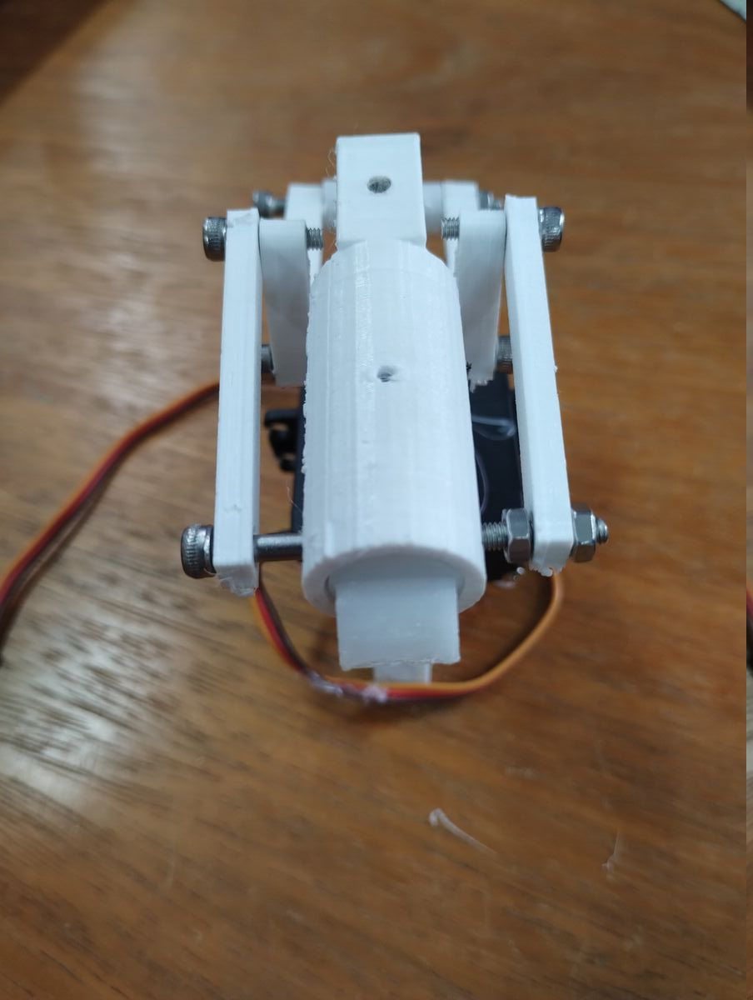
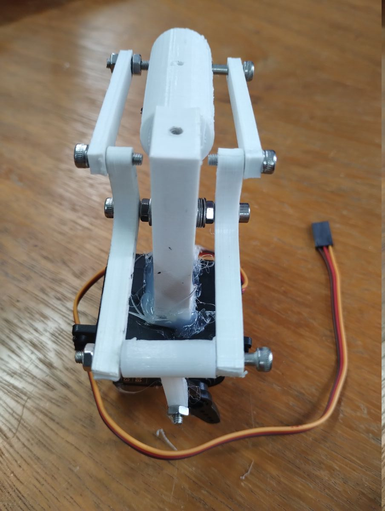
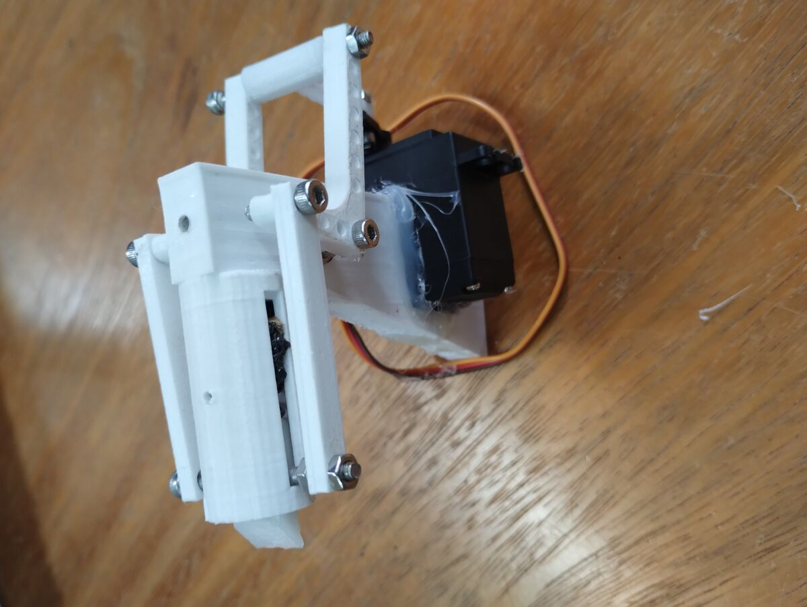
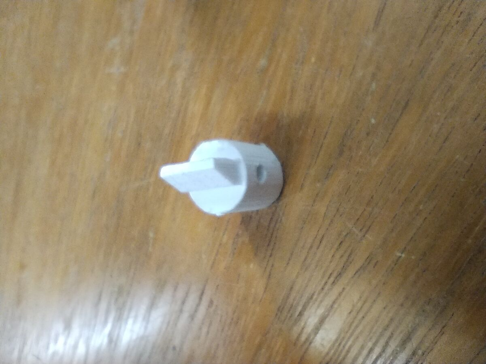
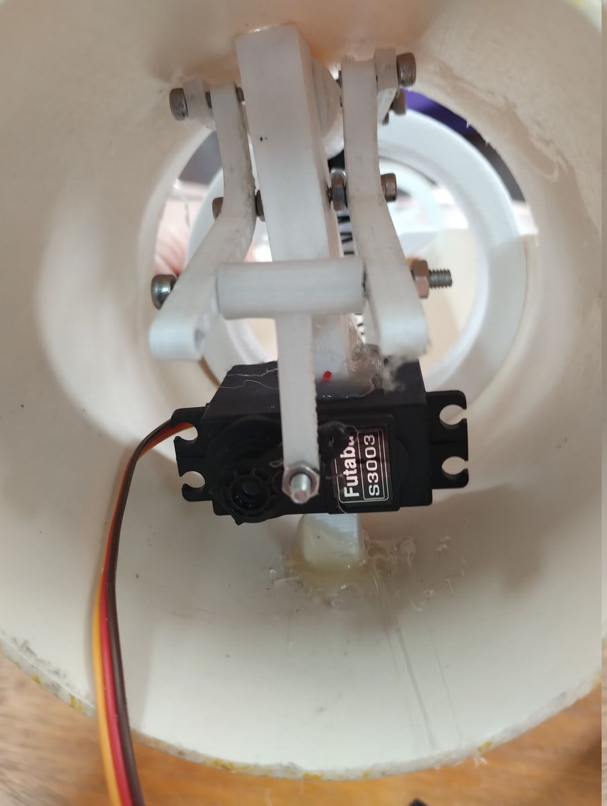
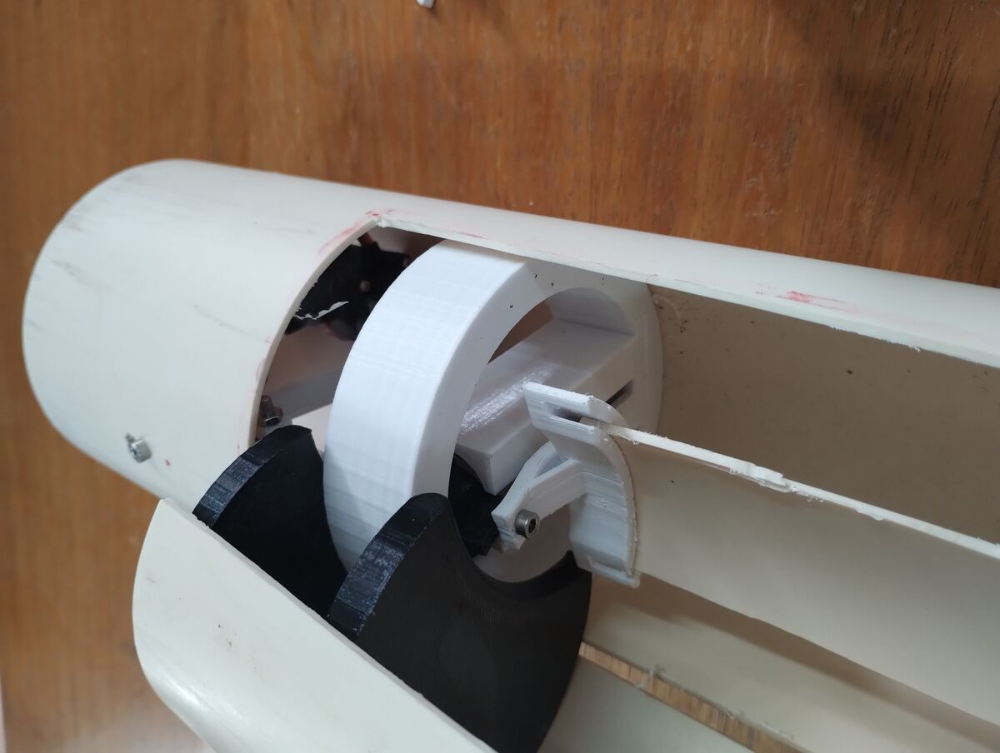
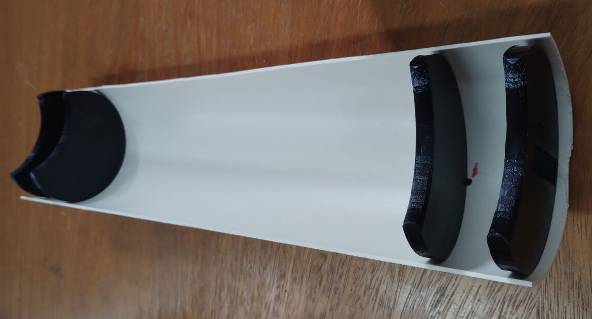

# Porta Lateral - Ratchet

> Sistema de retenção e liberação da porta lateral do módulo do paraquedas

[← Voltar ao DESIGN](./DESIGN.md)

---

## 1. Mecanismos

### 1.1 Cremalheira e Trava (Ratchet and Pawl)

O mecanismo **ratchet and pawl** permite movimento em uma direção enquanto trava o movimento reverso. Consiste em:
- **Cremalheira (ratchet):** Barra linear com dentes assimétricos
- **Trava (pawl):** Lingueta pivotante que engata nos dentes

**Propriedades:**
- Movimento unidirecional
- Tolerância de alinhamento (dentes engatam progressivamente)
- Fechamento dinâmico (trava em qualquer posição)

**Referências:**
- [Working process of the ratchet mechanism (ResearchGate)](https://www.researchgate.net/figure/Working-process-of-the-ratchet-mechanism-a-Initial-position-b-Picking-c-Locking_fig2_286477211)
- [Ratchet mechanism analysis (ScienceDirect)](https://www.sciencedirect.com/science/article/pii/S0094114X17307474)

### 1.2 Alavanca Angular (Bell Crank)

O **bell crank** converte movimento linear em outra direção, tipicamente 90°. Consiste em:
- **Alavanca:** Braço rígido com pivô central
- **Duas conexões:** Entrada e saída em ângulos diferentes

**Propriedades:**
- Conversão de direção de força
- Amplificação de força (quando braços têm tamanhos distintos)
- Simplicidade mecânica

No protótipo alpha, o bell crank utiliza braços de tamanhos diferentes para amplificar a força do motor. Isso permite usar uma mola mais forte com um motor mais fraco, mantendo a capacidade de abrir a porta.

---

## 2. Aplicação no Sistema

O mecanismo de recuperação utiliza os mecanismos acima para reter e liberar a porta lateral do paraquedas:

- **Ratchet and pawl** → retenção da porta
- **Bell crank** → orientação do solenoide perpendicularmente (futuro)

**Por que ratchet em vez de pino:**

| Aspecto | Pino de retenção | Linear ratchet |
|---------|------------------|----------------|
| Alinhamento | Precisão alta — pino deve coincidir com furo | Tolerante — dentes engatam progressivamente |
| Fechamento | Posição única de fechamento | Dinâmico — empurra e trava em qualquer ponto do curso |
| Robustez | Sensível a vibração e desgaste | Distribui carga ao longo dos dentes |

**Contexto de fabricação:**

O foguete é montado com múltiplas partes, em um processo complexo e demorado. Ter um mecanismo que permite fechamento dinâmico — sem precisar buscar uma posição exata — simplifica significativamente a montagem.

Além disso, não dispomos de ferramentas de precisão, e os materiais utilizados nos protótipos (como tubos de PVC) são resistentes mas deformáveis. Mecanismos tolerantes são mais adequados para essas condições.

---

## 3. Protótipo Alpha

#### Mecanismo com Servo Montado

<table>
  <tr>
    <td></td>
    <td></td>
    <td></td>
  </tr>
</table>

Mecanismo completo com servo motor montado. Vista frontal mostra o servo e o linkage. Vista traseira evidencia o pawl engatando nos dentes do ratchet. Vista lateral mostra o perfil completo do conjunto.

#### Pawl (Lingueta)

Detalhe do pawl isolado. A ponta engata nos dentes do ratchet para reter a porta.

#### Montagem no Módulo

<table>
  <tr>
    <td></td>
    <td></td>
    <td></td>
  </tr>
</table>

Mecanismo montado no módulo do paraquedas. Primeira foto: vista traseira com pawl visível. Segunda: zoom na porta entrando no módulo. Terceira: porta deslizando no trilho linear.

**Teste inicial (alpha)** — Validação de conceito com impressão 3D.

---

## 4. Acionamento

### 4.1 Servo Motor (atual)

<!-- TODO: Documentar por que servo, limitações, implementação -->

### 4.2 Solenoide (futuro)

O solenoide deve ser montado **perpendicularmente** ao eixo do foguete para evitar que forças inerciais durante o acionamento abram a porta prematuramente.

Utiliza **bell crank** (ver 1.2) para converter o movimento perpendicular do solenoide no movimento linear necessário para desengatar o pawl.

<!-- TODO: Condições para migração, testes necessários -->

---

## 5. Especificações e Cálculos

<!-- TODO: Documentar forças envolvidas, cálculos, tolerâncias de fabricação -->

---

## 6. Materiais e Manufatura

<!-- TODO: Documentar materiais: PLA, PETG, PC, alumínio -->

---

## 7. Análise de Falhas

<!-- TODO: Documentar modos de falha e mitigações -->

---

## 8. Referências

- [Working process of the ratchet mechanism (ResearchGate)](https://www.researchgate.net/figure/Working-process-of-the-ratchet-mechanism-a-Initial-position-b-Picking-c-Locking_fig2_286477211)
- [Ratchet mechanism analysis (ScienceDirect)](https://www.sciencedirect.com/science/article/pii/S0094114X17307474)
- [Adafruit Servo Guide](https://learn.adafruit.com/adafruit-arduino-lesson-14-servo-motors)

---

[← Voltar ao DESIGN](./DESIGN.md)
